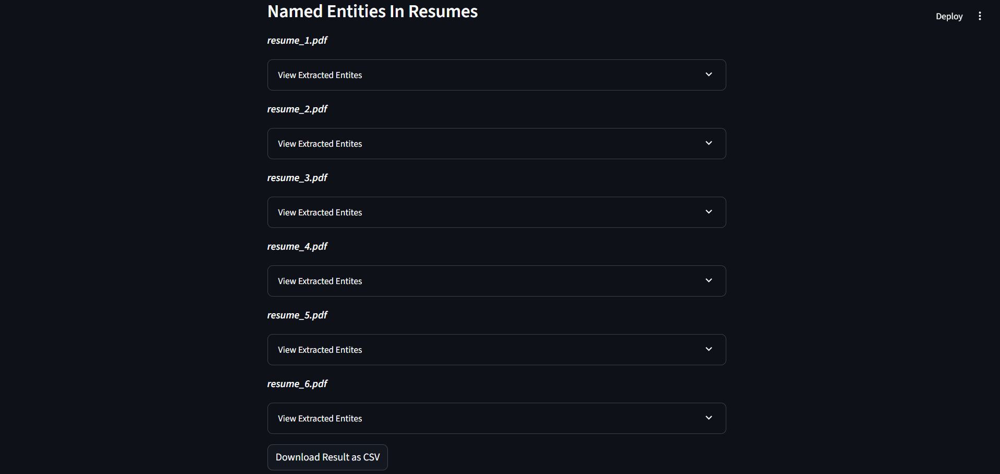

# AI Resume Screening & Candidate Ranking System

An AI-powered web app that reads resumes (PDFs), compares them to a job description, and ranks candidates by match score using NLP techniques like TF-IDF and cosine similarity. Built with Streamlit.

---

## Features

- Upload multiple PDF resumes
- Enter a custom job description
- Automatically extract text from resumes
- Rank candidates based on content similarity
- Show skill match count and matched keywords
- Download results as CSV
- Bar chart of resume scores
- Extract skills from job description automatically

---

## App Screenshots

### Home Page


### Ranked Candidate Output


### Downloaded CSV


---

## Live Demo
[Live Demo](https://adityachauhan99-ai-resume-screener.streamlit.app/)

---

## 🚀 How to Run

```bash
git clone https://github.com/your-username/ai-resume-screener.git
cd ai-resume-screener
pip install -r requirements.txt
streamlit run main.py
