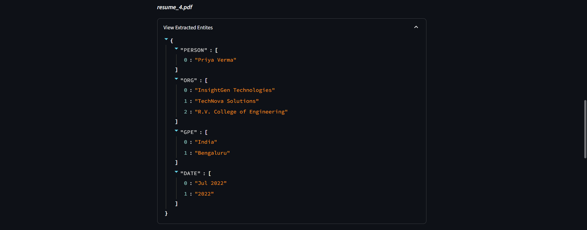
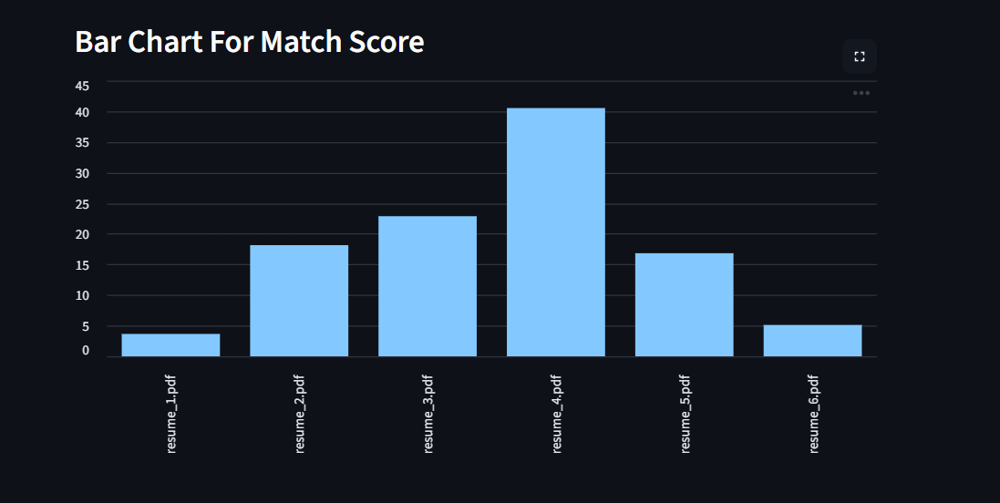
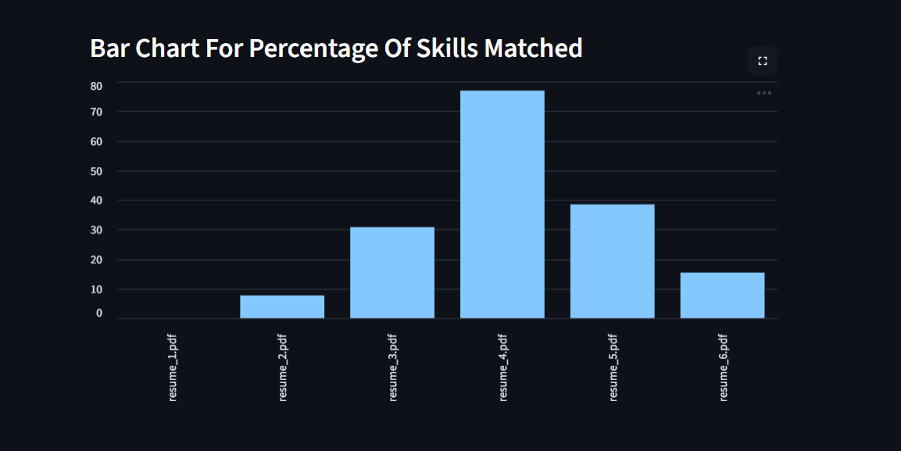

# 🧠 AI Resume Screening & Candidate Ranking System

An AI-powered web app that reads resumes (PDFs), compares them to a job description, and ranks candidates by match score using NLP techniques like **TF-IDF**, **cosine similarity**, **skill matching**, and **Named Entity Recognition (NER)**. Built with **Streamlit**.

---

## 🚀 Features

- Upload and parse multiple PDF resumes
- Enter a custom job description
- Automatically extract text using pdfplumber
- Extract skills from both job description and resumes
- Rank candidates by TF-IDF similarity to the JD
- Compute percentage of matched skills
- Show matched keywords and match count
- Named Entity Recognition using spaCy:
  - Extracts PERSON, ORG, GPE and DATE entities
- Visualize:
  - Match Score bar chart
  - Skill match percentage bar chart
- Export results as downloadable CSV
- User-friendly interface via Streamlit

---

## 📸 App Screenshots

### 🔹 Home Page


### 🔹 Ranked Candidate Output


### 🔹 Named Entities In Resumes


### 🔹 Output Of NER


### 🔹 Bar Chart For Match Score


### 🔹 Bar Chart For Percentage Of Skills Matched


### 🔹 Downloaded CSV


---

## 🔗 Live Demo
[👉 Click Here for Live Demo](https://adityachauhan99-ai-resume-screener.streamlit.app/)

---

## 🛠 How to Run Locally

```bash
git clone https://github.com/adityachauhan99/ai-resume-screener.git
cd ai-resume-screener
pip install -r requirements.txt
streamlit run main.py
